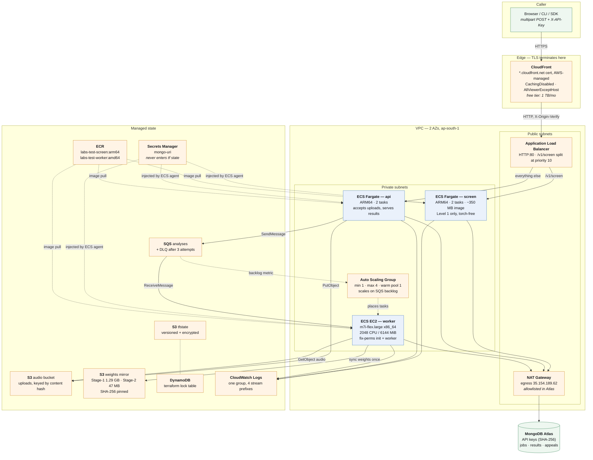
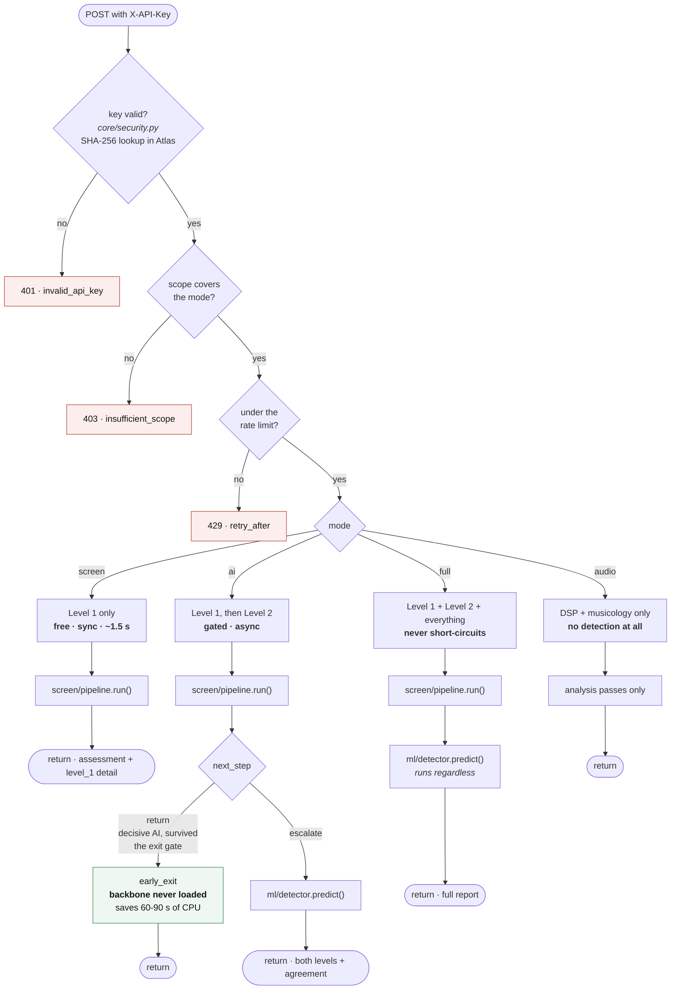
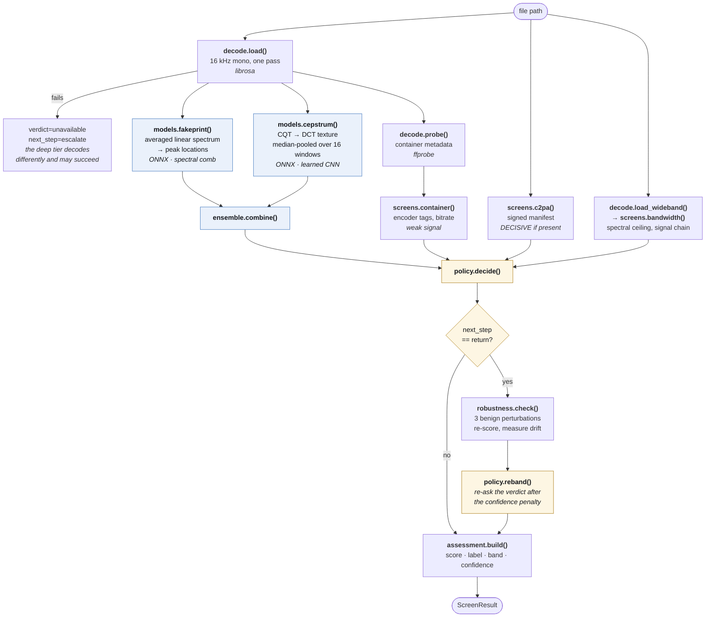
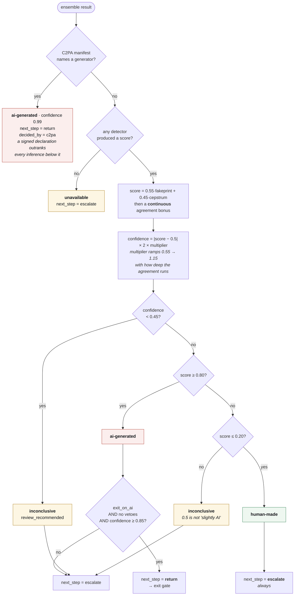
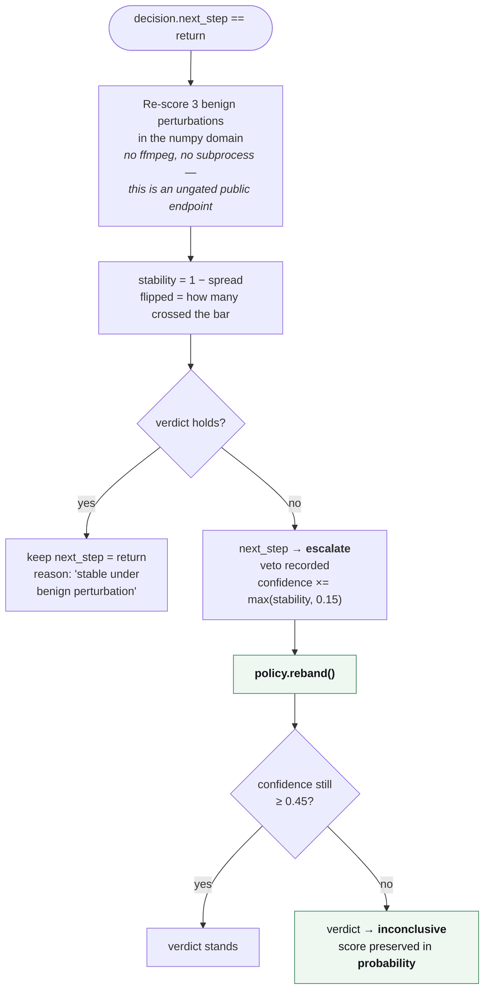
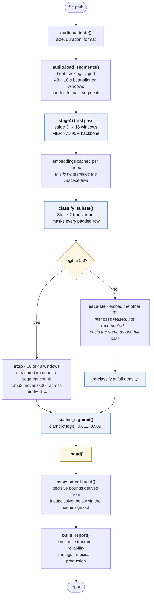
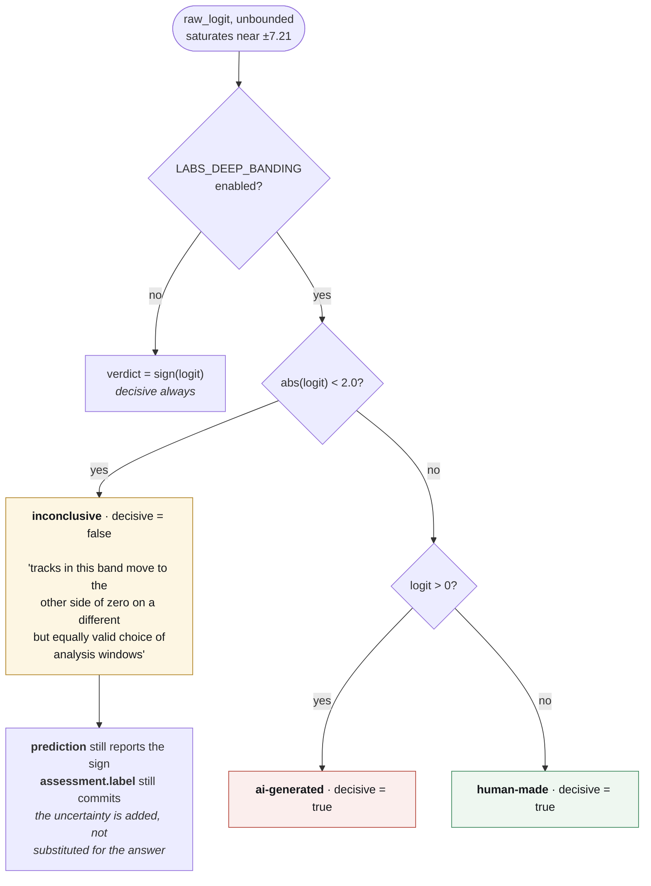
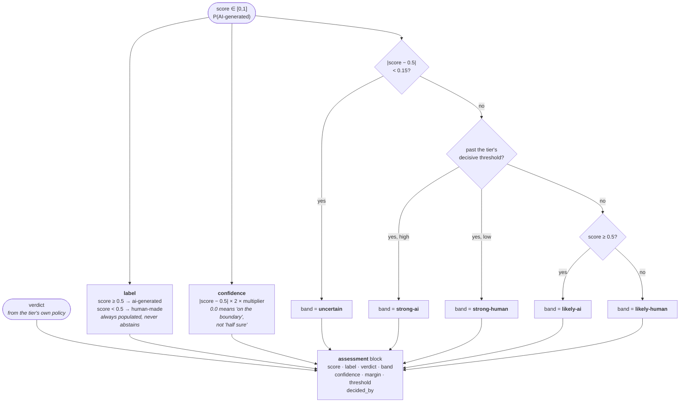
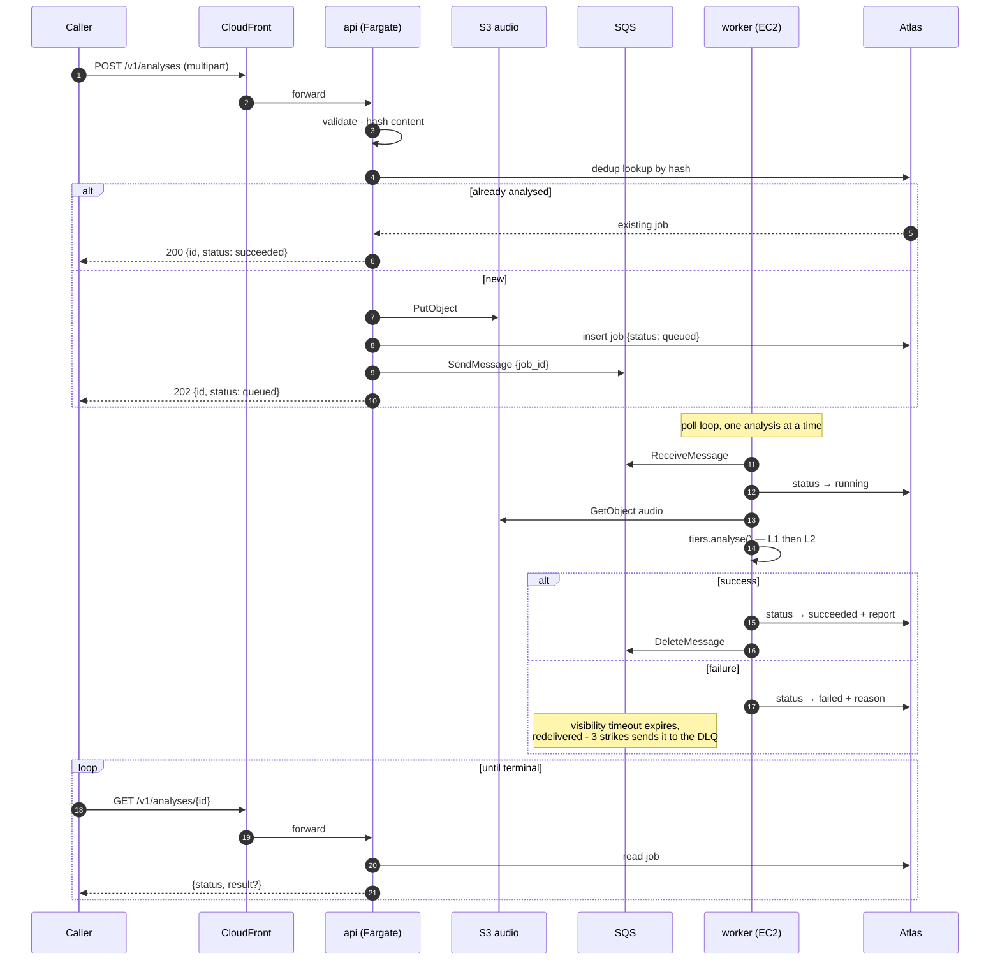

# Flow diagrams

Every tool, every step, every decision. Nine diagrams, from the AWS topology
down to the arithmetic that turns two model outputs into a published verdict.

`flow.md` tells the same story in prose with ASCII art and is the better read
for understanding *why*. This file is the reference for *what happens where*,
and every box names the module or AWS resource that does the work.

1. [System topology — every AWS service](#1-system-topology)
2. [Request lifecycle — the four modes](#2-request-lifecycle)
3. [Level 1 internals](#3-level-1-internals)
4. [Level 1 decision logic](#4-level-1-decision-logic)
5. [The exit gate](#5-the-exit-gate)
6. [Level 2 internals](#6-level-2-internals)
7. [Level 2 decision logic](#7-level-2-decision-logic)
8. [The assessment envelope](#8-the-assessment-envelope)
9. [Async job lifecycle and failure paths](#9-async-job-lifecycle)

---

## 1. System topology

Every AWS service in the stack, what it holds, and which component touches it.



**Which resources exist and how many run at once**

| Resource | Steady state | Why |
|---|---|---|
| Fargate `screen` | 2 tasks | One per AZ. Ungated route, so it absorbs anonymous bursts. |
| Fargate `api` | 2 tasks | One per AZ for the ALB to have two healthy targets. |
| EC2 worker | 1 instance, 1 task | One analysis per container — the pipeline is CPU-bound, so two concurrent runs each go at half speed. |
| Warm pool | 1 stopped instance | Billed for its EBS volume only; resumes in ~30 s instead of the 3–5 min a cold launch takes. |
| NAT Gateway | 1 | Single egress IP, which is what Atlas allowlists. |
| CloudFront | 1 distribution | TLS. |

---

## 2. Request lifecycle

Four modes. The difference between them is which tiers run and whether the
short-circuit is allowed.



> `full` never short-circuits on purpose. A full report is bought for its
> evidence — the per-window timeline, the embeddings, the musicological pass —
> and omitting the deep layers because a cheap model was confident would
> deliver a thinner document than the one that was paid for.

---

## 3. Level 1 internals

One decode, shared by every stage below it. Every stage is
exception-isolated: a screen that throws degrades to "that screen is
unavailable" and never to a failed request, because Level 1 is the ungated tier
and therefore the one most exposed to whatever a stranger uploads.



### Why fusion is not `max()`

```
    final = max(p_fakeprint, p_cepstrum)
```

is an OR gate. If **either** model false-positives, the ensemble
false-positives. At 2% FPR each with partly independent errors the union
approaches ~4%: the false-accusation rate has doubled while the change felt
like an improvement.

| Pattern | Reading |
|---|---|
| both high | Two representations, two methods, one conclusion. Confident. |
| both low | The same, in the other direction. Confident. |
| cepstrum only | Texture present, comb absent. Consistent with **processed** generator output — a pitch shift or resample smears the comb while the texture survives on a log axis. |
| fakeprint only | Comb present, texture absent. Bitcrushing and sample-rate reduction manufacture a comb by the same mechanism as vocoder upsampling, so this also fits a heavily processed **human** track. |

---

## 4. Level 1 decision logic



**The asymmetry is the whole design.** On a marketplace, wrongly flagging a
human producer costs a customer and a public complaint; missing one AI track
costs very little. So:

- the AI bar sits at **0.80** and the human bar at **0.20**, and the gap is
  reported as `inconclusive` rather than rounded to whichever side is nearer;
- a confident **AI** may end the request;
- a confident **human** *never* does. Both Level-1 models know only the
  generators they were trained on, so their silence is not evidence. Level 1
  alone never publishes an exoneration.

---

## 5. The exit gate

Runs **only** for tracks the policy already wants to return on — a small
fraction of traffic, and exactly the fraction that was about to skip the
expensive tier anyway.



> **The bug this closes.** The penalty used to be applied *after* banding, and
> the verdict was left standing on a confidence that no longer cleared the bar
> which produced it. Measured on `ai1.mp3`: `ai-generated` published at
> confidence **0.231** against a `min_confidence` of **0.45**. The number and
> the verdict disagreed, and the number was the honest one.

---

## 6. Level 2 internals



### Why a cascade and not just fewer segments

Measured on the real checkpoints over 10 tracks at strides 1–4, sensitivity to
segment count is purely a function of confidence:

| Confidence | Behaviour |
|---|---|
| `\|logit\| ≥ 5` | Immune. `1.mp3` moves 0.004 between stride 1 and stride 4. |
| `\|logit\| < 2` | Unstable. `ai1` **flips** Fake→Real at stride 2; `ai4` collapses +4.574 → +0.937. |

Blanket decimation is therefore not a free speedup — it is an accuracy trade
that happens to be invisible on the easy majority. The cascade buys the same
time from only the tracks that provably do not need it.

---

## 7. Level 2 decision logic



`ai1.mp3` is the case that forces the band. It sits at `|logit| 0.4` — a coin
flip — and lands on opposite sides of zero depending on which windows Stage-1
was given: **+0.393** on upstream's first-48 plan, **−0.421** once the windows
are spread across the whole track. Both readings are honest and neither is a
verdict, but publishing the sign turned that into "Fake" one day and "Real"
the next.

---

## 8. The assessment envelope

One definition of score, label, band and confidence, built the same way by both
tiers. `assessment.py` owns all of it.



**`label` and `verdict` answer different questions, and the service owes both.**

| Field | Question | Abstains? |
|---|---|---|
| `label` | "If you had to pick a side, which?" | Never |
| `verdict` | "Is this worth acting on?" | Yes — `inconclusive` |
| `band` | "How strong, regardless?" | No — always one of five |

Rounding a coin flip to the nearer side and publishing it as a finding is how a
detector acquires a false-accusation rate it cannot see. But refusing to say
anything is useless to a caller running a bulk triage queue who has their own
review step. So both are reported, computed from the same score, and a caller
picks by risk appetite instead of by whatever the service decided for them.

**Decisive thresholds per tier** — passed in, never hardcoded, so `band` and
`verdict` cannot disagree about the same track:

| Tier | AI decisive at | Human decisive at | Source |
|---|---|---|---|
| Level 1 | `score ≥ 0.80` | `score ≤ 0.20` | `ai_threshold` / `human_threshold` |
| Level 2 | `score ≥ 0.8808` | `score ≤ 0.1192` | `σ(±inconclusive_below)` |

---

## 9. Async job lifecycle



### Failure paths

| Failure | Where it surfaces | Behaviour |
|---|---|---|
| Decode fails at Level 1 | `pipeline.run` | `verdict=unavailable`, `next_step=escalate`. Never raises — the deep tier decodes differently and may succeed. |
| One Level-1 screen throws | `timed()` wrapper | Recorded in `errors{}`, other screens continue. |
| Worker cannot write `/models` | container start | `fix-perms` init container chowns the host path first; `dependsOn: SUCCESS` means the worker cannot start before it exits. |
| Checkpoint digest mismatch | `ml/checkpoints` | Refuses to load. `LABS_OFFLINE=true` blocks the HuggingFace fallback. |
| Job fails 3× | SQS redrive | Lands in the DLQ. Anything there failed *deterministically*, not transiently. |
| Atlas read lag | status polling | A job can report `queued` immediately after `succeeded` — Atlas serves reads from a secondary. Clients must confirm a terminal status twice. |
| Instance scale-in mid-analysis | ASG lifecycle hook | `ECS_CONTAINER_STOP_TIMEOUT=3m` + draining: the task finishes rather than being killed. |

---

## Where the time goes

| Step | Cost | Notes |
|---|---|---|
| Decode (16 kHz mono) | ~0.3 s | Shared by every Level-1 stage. |
| fakeprint | ~0.2 s | 1.2 MB ONNX. |
| cepstrum | ~0.6 s | CQT dominates. |
| Level 1 total | **~1.5 s** | Synchronous. |
| Exit gate | ~1.5 s | Only on early-exit candidates. |
| Beat tracking + segmentation | ~5 s | |
| MERT backbone, 16 windows | ~25 s | Cascade first pass. |
| MERT backbone, 48 windows | ~75 s | Only when the first pass is borderline. |
| Level 2 total | **50–115 s** | CPU. |

The cascade is the whole economic argument: it removes ~60 s of backbone CPU
from every track the first pass already settled, and Level 1's early exit
removes the backbone entirely from the tracks that need it least.
